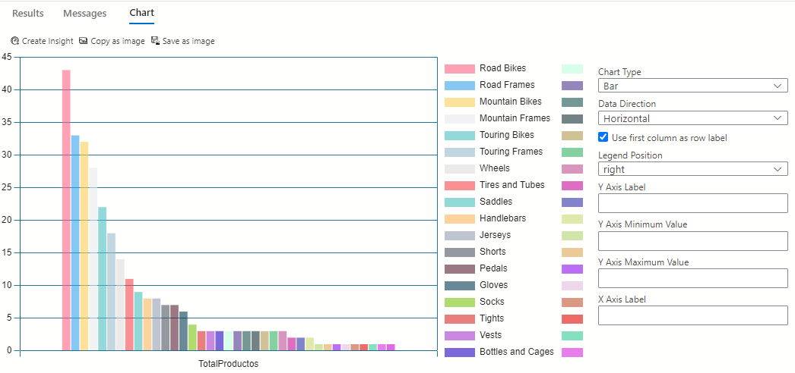

```sql
SELECT 
    pc.Name AS Category,
    COUNT(p.ProductID) AS TotalProductos
FROM SalesLT.ProductCategory pc
JOIN SalesLT.Product p 
    ON pc.ProductCategoryID = p.ProductCategoryID
GROUP BY pc.Name
ORDER BY TotalProductos DESC;

```

Configuración de la gráfica de barras:


## NOTA: **Guardar los queries**